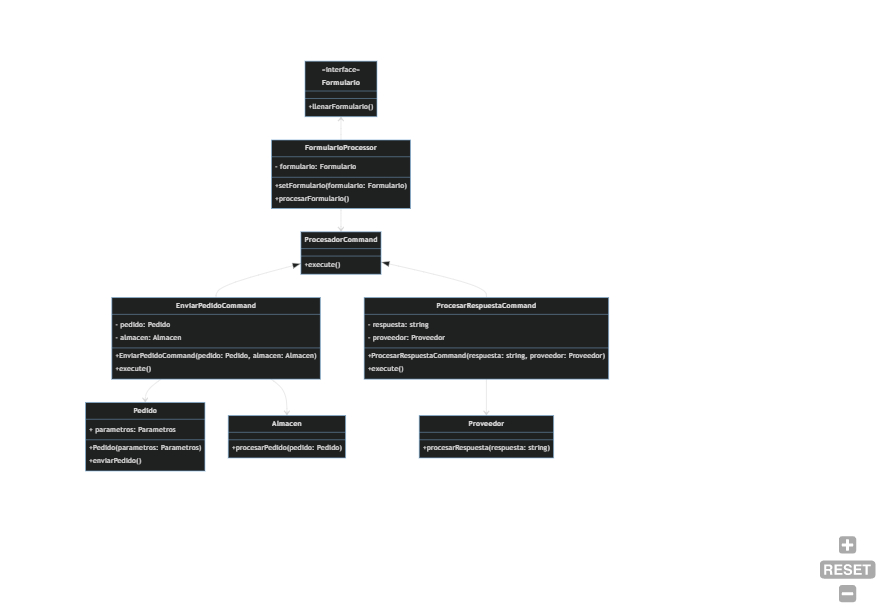
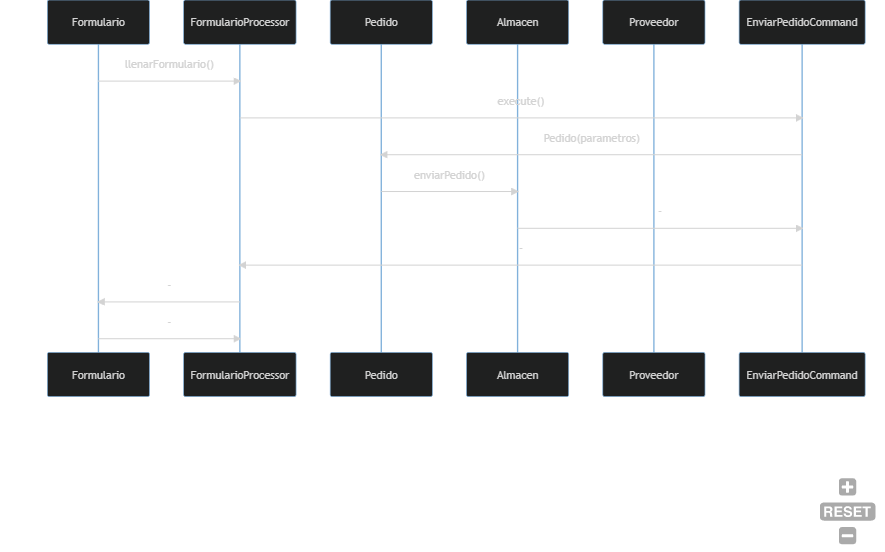
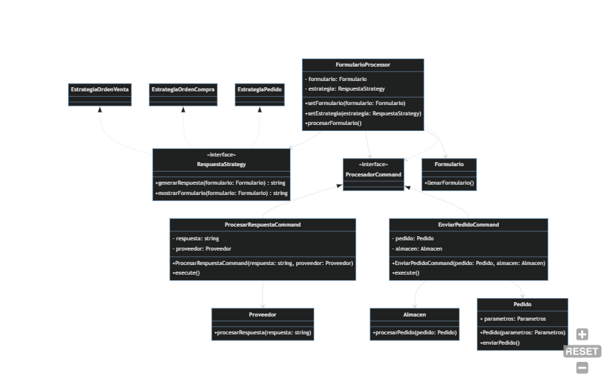

# Solucion ejercicio Distribuidora
## a) Aplicando el patrón command:
 

1. `Formulario`: Representa un formulario genérico. Tiene un método llenarFormulario() que puede ser implementado por diferentes tipos de formularios en el futuro. Esta clase es la base para la creación de nuevos tipos de formularios.

2. `FormularioProcessor`: Es responsable de procesar el formulario y generar una respuesta adecuada. Tiene una referencia al formulario actual y métodos como setFormulario() para establecer el formulario y procesarFormulario() para iniciar el procesamiento. Esta clase se comunica con el ProcesadorCommand para ejecutar las operaciones necesarias.

3. `Pedido`: Representa un pedido genérico con parámetros. Tiene una referencia a los parámetros necesarios y métodos como enviarPedido() para enviar el pedido. Esta clase puede ser extendida o implementada por diferentes tipos de pedidos en el futuro.

4. `Almacen`: Representa el almacén al que se envían los pedidos. Tiene un método procesarPedido() que recibe un pedido y realiza las acciones correspondientes en el almacén.

5. `Proveedor`: Representa un proveedor que procesa una respuesta específica. Tiene un método procesarRespuesta() que recibe la respuesta y realiza las acciones necesarias en el proveedor.

6. `ProcesadorCommand`: Es una interfaz o clase base para los comandos de procesamiento. Define un método execute() que debe ser implementado por todas las clases de comandos.

7. `EnviarPedidoCommand`: Es un comando concreto que implementa ProcesadorCommand. Tiene referencias al pedido y al almacén correspondiente. El método execute() se encarga de enviar el pedido al almacén.

8. `ProcesarRespuestaCommand`: Es otro comando concreto que implementa ProcesadorCommand. Tiene referencias a la respuesta y al proveedor correspondiente. El método execute() se encarga de procesar la respuesta en el proveedor.

## b)  Diagrama de clases

1. El objeto `Formulario` recibe los datos del pedido y llama al método llenarFormulario().
2. El objeto `FormularioProcessor` recibe el formulario y llama al método `execute()` del objeto `EnviarPedidoCommand`.
3. El objeto `EnviarPedidoCommand` crea un objeto `Pedido` con los parámetros del formulario y llama al método `enviarPedido()`.
4. El objeto `Pedido` envía el pedido al objeto `Almacen`.
5. El objeto `Almacen` procesa el pedido.
6. El objeto `Almacen` notifica al objeto `EnviarPedidoCommand` sobre la finalización del procesamiento.
7. El objeto `EnviarPedidoCommand` notifica al objeto `FormularioProcessor` sobre la finalización del envío del pedido.
9. El objeto `FormularioProcessor` finaliza su procesamiento y espera futuros formularios.

## c) Apartado 3
 

En este diseño, se utiliza la clase FormularioProcessor para procesar el formulario y delegar la generación de respuestas y la presentación del formulario a la estrategia correspondiente, que implementa la interfaz RespuestaStrategy. Cada estrategia concreta define cómo se genera la respuesta y cómo se muestra el formulario según el tipo de formulario.

De esta manera, el resto del código no necesita saber cómo se generan las respuestas o cómo se muestran los formularios, ya que se encapsula en las estrategias correspondientes. Además, es fácil agregar nuevas estrategias para manejar diferentes tipos de formularios sin afectar el resto del código.
