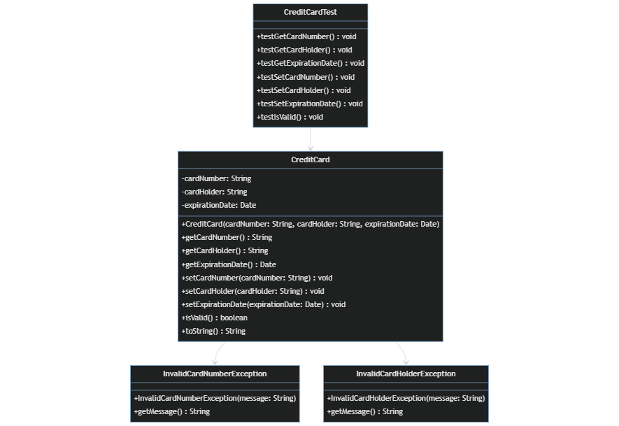

# CREDIT CARD USANDO JUnit 
En este ejercicio he usado JUnit para hacer una clase tanto para una clase que represente una tarjeta de crédito como para una clase para los test de la clase tarjeta de crédito. A parte de un par de clases de excepciones para el caso de una transaccion invalida como para un balance invalido.

## DIAGRAMA UML

